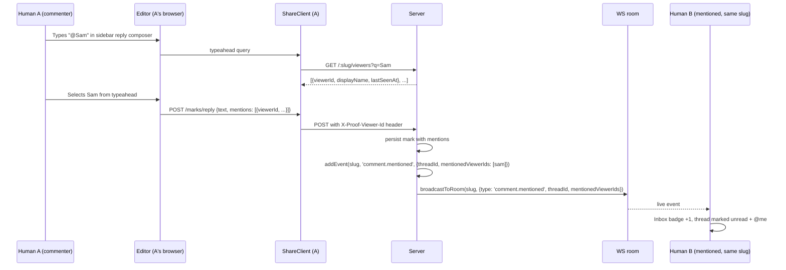
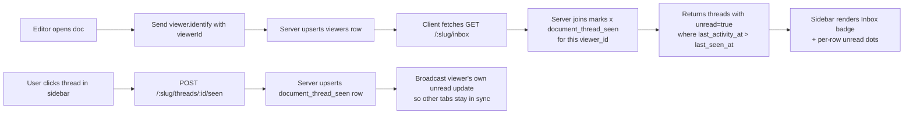

# feat: Comment sidebar with Inbox and @-mentions

## Overview

Add a right-docked comment sidebar to the Proof editor that lists all comment threads on the open document, surfaces activity since the viewer's last visit in an Inbox tab, and lets viewers reply and @-mention humans or agents without leaving the sidebar. Introduces a stable viewer UUID as a new identity primitive so mentions and unread state have a durable target across sessions in the same browser.

Coexists with the existing inline mark popover — the sidebar is the aggregated surface; the popover remains the inline interaction. Comments only; suggestions deferred.

---

## Problem Frame

Today comment threads on a Proof doc are only discoverable by clicking a marked span in the editor. There is no aggregated view, no return-to-doc "what's new" signal, and no way to direct a comment at a specific collaborator. Agents leave comments on docs during autonomous runs but humans have no dedicated surface to catch up on that activity.

The brainstorm (see origin: `docs/brainstorms/comment-sidebar-requirements.md`) settled on a right-rail sidebar with Doc and Inbox tabs, coexistence with the popover, stable viewer UUIDs for mentions, and agents as mentionable entities.

---

## Requirements Trace

- R1. Aggregated visibility of all comment threads on the open doc in a persistent right rail.
- R2. "What's new since I last looked" clarity via an Inbox tab with unread markers.
- R3. Reply from the sidebar without losing context; no navigation away.
- R4. @-mention a known human or agent from the composer; target sees it surfaced in their Inbox.
- R5. Sidebar and inline popover coexist; clicking a thread in the sidebar scrolls to the anchor and opens the popover focused on the reply composer.
- R6. Comments only. Suggestions (insert/delete/replace) do not appear in the sidebar.
- R7. Orphaned threads (anchor text deleted) remain visible in a Detached section.
- R8. Mobile parity: full-width sheet instead of a rail, same row shape and tabs.
- R9. Resolved threads hidden behind a "Show resolved" toggle, off by default.
- R10. Stable per-browser viewer UUID identifies the viewer across sessions.
- R11. Mention chips render distinctly in comment text (authoritative from structured data, not raw text).

---

## Scope Boundaries

- No browser push or email notifications.
- No real user accounts, email login, or cross-device identity sync.
- No `@channel` / `@here` broadcast mentions.
- No resolve-from-sidebar action; resolve stays in the popover for v1.
- No suggestion marks in the sidebar; accept/reject stays in the popover.
- No sidebar-initiated new threads without a text anchor; creation still starts from selection in the editor.

---

## Context & Research

### Relevant Code and Patterns

- `src/formats/marks.ts:212` — `StoredMark` interface. Adding an optional `mentions` field is forward-compatible; existing clients ignore unknown keys.
- `src/editor/plugins/marks.ts:1507` — `getMarks(state)` returns the live marks array used by decorations and the popover; the sidebar reuses this as its data source.
- `src/ui/agent-presence.ts:464` — `initAgentPresence(container, options)` mount pattern: synchronous init, appends a created element, subscribes to a data source, returns an unsubscribe. New `initCommentsSidebar` mirrors this pattern.
- `src/ui/name-prompt.ts` — owns the viewer-name localStorage key and modal. Viewer UUID generation attaches here on first interaction.
- `src/bridge/share-client.ts:266` — `setViewerName` was just fixed to re-identify over WS on name change. The same file is the natural home for viewer UUID management and the `X-Proof-Viewer-Id` header on API calls.
- `src/bridge/collab-client.ts:490` — `setLocalUser` propagates user identity to Yjs awareness; the sidebar should read from awareness for "currently connected" in the typeahead.
- `server/agent-routes.ts:3396` — `POST /marks/comment` handler. Extend payload parsing to accept `mentions: [...]` and persist on the mark.
- `server/agent-routes.ts:3576` — `POST /marks/reply` handler. Same mentions extension.
- `server/document-engine.ts:1571` — `addComment` builder. Currently assembles the stored mark; extend to persist `mentions`.
- `server/ws.ts:364` — `viewer.identify` WS handler. Extend to accept and store `viewerId`.
- `server/ws.ts:380` — `broadcastViewerList` pattern for fan-out. New `comment.mentioned` broadcast follows the same shape.
- `server/db.ts:2186` — `addEvent(slug, type, data, actor)`. New event types `comment.added` and `comment.mentioned` slot in here.
- `server/agent-routes.ts:3904` — `GET /:slug/events/pending` long-poll endpoint. Used as a fallback for mention delivery when WS is unavailable.

### Institutional Learnings

- `docs/solutions/` does not exist in this repo. No prior learnings to carry forward.

### External References

- None needed. Feature builds on existing patterns; no new third-party integrations.

### Recent Related Work

- Viewer-name re-identify fix (2026-04-23) in `src/bridge/share-client.ts` — the sidebar relies on that fix landing before live name updates will propagate correctly.
- `dist/` static-mount fix (2026-04-23) in `server/index.ts` — required for the rebuilt editor bundle to be served; sidebar work depends on this.

---

## Key Technical Decisions

- **Unread state lives server-side.** A new `document_thread_seen` table keyed by `(slug, viewer_id, thread_id, last_seen_at)` drives Inbox semantics. Client-side unread would reset on fresh tabs for the same viewer UUID and cannot be inspected by agents; server-side is small, cheap, and extensible.
- **Mentions are stored structurally on the mark.** The mark gains `mentions: Array<{viewerId, displayName, startOffset, endOffset}>`. Raw `text` still contains `@name` for fallback display and search, but the array is authoritative for "who was mentioned" queries. Avoids text-parsing brittleness when names contain spaces, punctuation, or collisions.
- **Viewer UUID is a client-minted primitive persisted in localStorage.** Generated once, attached to every API request via `X-Proof-Viewer-Id` and to every WS connection via the `viewer.identify` frame. Server upserts a (slug, viewer_id, display_name, last_seen_at) row for display lookup and typeahead.
- **Rail collapsed state is global.** Single localStorage key `proof-comments-sidebar-collapsed`. Per-slug is minor benefit and multiplies state.
- **Typeahead caps at 20 by recency with a "load more" row.** Prevents runaway for busy docs; real pagination is deferred.
- **Sidebar reads marks from the live editor plugin state, not from a new server poll.** The marks plugin already drives the popover; reusing the same data source avoids divergence between popover and sidebar views.
- **Mention delivery rides existing infrastructure.** Publish a `comment.mentioned` event via `broadcastToRoom` for live WS updates; also append to the `/events/pending` feed so reconnecting clients catch up without special-case backfill.
- **Coexistence rule.** The sidebar click scrolls the editor to the anchor, pulse-highlights the mark, and opens the existing popover focused on the reply composer. The sidebar's own inline composer is for quick replies; the popover remains the detailed thread surface.

---

## Open Questions

### Resolved During Planning

- **Server-side vs client-side unread bookkeeping?** Server-side (see Key Technical Decisions). Small table, durable across reloads within a viewer UUID.
- **Rail collapse state scope?** Global, one localStorage key.
- **Typeahead scope cap?** Top 20 by recency with "load more." No true pagination for v1.

### Deferred to Implementation

- Exact DOM structure for rail rows and composer (shape is settled; pixel details emerge during build).
- Whether Yjs awareness alone is sufficient for "currently connected" in typeahead, or whether we need a parallel WS viewer registry read. Depends on whether agent presence rides awareness or a separate channel; verify at implementation time.
- Whether the mark `mentions` field can be serialized through the existing Yjs-to-canonical pipeline without bespoke handling, or whether `canonicalizeStoredMarks` needs a tweak. Read the canonicalizer at unit time; do not pre-guess.
- Exact storage strategy for `document_thread_seen`: separate table vs. a column on `document_access`. Decide based on access-epoch invalidation semantics when you touch `server/db.ts`.

---

## High-Level Technical Design

> *This illustrates the intended approach and is directional guidance for review, not implementation specification. The implementing agent should treat it as context, not code to reproduce.*

Data and event flow for the "someone mentions me" path:

Unread state computation on doc open:

---

## Implementation Units

- [ ] U1. **Stable viewer UUID primitive**

**Goal:** Introduce a per-browser viewer UUID stored in localStorage, propagate it on every API request and WS frame, and persist an upsert record server-side so the viewer's name + last-seen is queryable by slug.

**Requirements:** R4, R10

**Dependencies:** None

**Files:**
- Create: `src/bridge/viewer-identity.ts` — owns the UUID generation, localStorage read/write, and accessor functions
- Modify: `src/bridge/share-client.ts` — attach `X-Proof-Viewer-Id` to every fetch helper; extend the `viewer.identify` WS payload to include `viewerId`
- Modify: `src/ui/name-prompt.ts` — pair UUID generation with name capture so both land atomically on first visit
- Modify: `src/editor/index.ts` — use the new identity module at init (around `src/editor/index.ts:1371`)
- Modify: `server/ws.ts` — extend `viewer.identify` handler to read and persist `viewerId` on the `ClientConnection` record
- Modify: `server/db.ts` — add `upsertViewer(slug, viewerId, displayName)` and `listRecentViewers(slug, limit)` helpers; add migration for a new `document_viewers` table if a separate table is chosen, or extend an existing one
- Modify: `server/agent-routes.ts` — add `GET /:slug/viewers` endpoint returning the typeahead union (presence + recent commenters + agents)
- Test: `src/tests/viewer-identity.test.ts`

**Approach:**
- Generate a v4 UUID on first localStorage miss; persist under key `proof-viewer-id`.
- `X-Proof-Viewer-Id` header is attached by a central helper in `share-client.ts`; all existing fetch call sites pick it up.
- `viewer.identify` gets a `viewerId` field alongside `name` and `capabilities`.
- Server-side: read the header on agent-route requests, attach to `req` as `viewerId`, upsert a `document_viewers` row on every state read or mutation.
- The typeahead endpoint returns up to 20 entries union-merged from: (a) currently connected clients via the WS room registry, (b) recent commenters via a join on marks, (c) active agents via the presence table.

**Patterns to follow:**
- Header propagation: mirror how `x-share-token` is attached today in `src/bridge/share-client.ts:279`.
- DB helpers: follow the style in `server/db.ts` for `createDocumentAccessToken`.
- New endpoint: mirror `GET /:slug/state` in `server/agent-routes.ts:1966` for auth + shape.

**Test scenarios:**
- Happy path: on first call to `getOrCreateViewerId()`, UUID is generated, persisted, and returned; subsequent calls return the same value.
- Happy path: `share-client.ts` attaches `X-Proof-Viewer-Id` on every fetch after the identity module is initialized.
- Edge case: when localStorage is unavailable (private browsing with quota denial), `getOrCreateViewerId()` falls back to an in-memory UUID for the session and does not throw.
- Happy path: server upserts a `document_viewers` row on receiving the header; display name updates on subsequent requests with a new name.
- Edge case: typeahead dedupes by viewer UUID when a viewer appears in both presence and recent-commenters lists.
- Error path: `GET /:slug/viewers` without a valid share token returns 401 with the existing `UNAUTHORIZED` shape.

**Verification:**
- A fresh browser profile opens the doc, gets a UUID, and the server has a row for (slug, viewerId, displayName) visible via a read.
- The same browser profile reopens later and reuses the same viewer UUID.
- `GET /:slug/viewers` returns the authenticated viewer plus any active agents for that slug.

---

- [ ] U2. **Right-rail sidebar shell with Doc tab**

**Goal:** Mount a collapsible right-rail element that lists all non-resolved comment threads in document order, sourced from the live marks plugin state, and wire click-to-jump: clicking a row scrolls the editor to the anchor, pulse-highlights the mark, and opens the existing popover focused on the reply composer.

**Requirements:** R1, R5, R7, R9

**Dependencies:** U1

**Files:**
- Create: `src/ui/comments-sidebar.ts` — `initCommentsSidebar(container, { onThreadClick, onThreadReply, getMarks })` mirroring `initAgentPresence`
- Modify: `src/editor/index.ts` — mount the sidebar in the editor shell, pass an `onThreadClick` callback that drives scroll + popover
- Modify: `src/index.html` — right-rail CSS: `.comments-sidebar`, `.comments-sidebar-collapsed`, row styling, "Show resolved" toggle
- Modify: `src/editor/plugins/marks.ts` — expose a small helper to subscribe to mark changes (or document what plugin-key-based listening looks like) so the sidebar can re-render on updates without direct plugin-internal access
- Test: `src/tests/comments-sidebar.test.ts`

**Approach:**
- Rail is a sibling of the editor container in the main layout; ~320px default, fixed for v1 (no resize handle).
- Data source: call `getMarks(editorView.state)` (already exported from `src/editor/plugins/marks.ts:1507`), filter to `kind === 'comment'`, sort by document-order via the resolved range `from` offset.
- Rows render: truncated anchor quote, author display (reuse `src/ui/agent-identity-icon.ts` for agent rows), relative time of latest reply, reply count chip, resolved chip.
- Click handler: dispatch a transaction to the editor view that scrolls to the mark's range and sets a transient "pulse" decoration for ~1s; then call the existing popover open function with `{ markId, focusComposer: true }`.
- Detached threads: marks whose anchor no longer resolves appear in a collapsible "Detached" section at the bottom of the Doc tab with the stored `quote` as context.
- "Show resolved" toggle: adds resolved threads back to the list in doc order, visually dimmed.
- Rail collapsed state: single localStorage key `proof-comments-sidebar-collapsed` drives the initial render.

**Patterns to follow:**
- Mount pattern: `src/ui/agent-presence.ts:464`.
- Styling: follow the `.mark-popover` visual language in `src/index.html` for font, spacing, and chip style.
- Pulse highlight: extend the existing `pulse` decoration pattern in the marks plugin (currently only applied by the accept/reject flow).

**Test scenarios:**
- Happy path: sidebar renders one row per comment mark in document order.
- Happy path: clicking a row fires `onThreadClick(markId)`; the editor scrolls such that the anchor is in view.
- Edge case: comment whose anchor quote has been deleted appears in the "Detached" section with the stored quote preserved.
- Edge case: "Show resolved" toggled on reveals resolved threads dimmed in doc order; toggled off hides them again.
- Happy path: collapsed state persists across reloads via the single localStorage key.
- Edge case: sidebar with zero comment marks shows an empty state ("No comments yet") and no row area.
- Integration: popover opens focused on the reply composer after sidebar click.

**Verification:**
- Opening a doc with existing comments shows all threads in the rail.
- Clicking any row both scrolls the editor and opens the popover pre-focused on reply.
- Deleting the anchor text moves the thread to the Detached section without losing the thread.

---

- [ ] U3. **Inline reply composer in sidebar rows**

**Goal:** Let the viewer expand a sidebar row and post a reply without navigating away, using the same `POST /marks/reply` endpoint the popover uses. Preserves the sidebar as a fully-usable quick-response surface.

**Requirements:** R3, R5

**Dependencies:** U2

**Files:**
- Modify: `src/ui/comments-sidebar.ts` — expanded-row state, inline composer, submit handler
- Modify: `src/bridge/share-client.ts` — expose a `postReply(slug, markId, text, mentions?)` helper if not already present; otherwise reuse the existing reply path
- Modify: `src/index.html` — expanded row + composer styles (re-use `.mark-popover-textarea` visual language)
- Test: `src/tests/comments-sidebar-reply.test.ts`

**Approach:**
- Clicking a row once scrolls + opens the popover. Clicking a "Reply" affordance inside the row (disclosure triangle or pencil icon) expands the row inline with a small textarea + post button — no popover involvement.
- Submit posts to the same endpoint the popover uses; on success the mark updates flow back through the marks plugin and the sidebar re-renders the thread with the new reply count.
- Error handling: on 4xx/5xx, show an inline error under the composer and preserve the draft text.
- Mentions typeahead (implemented in U4) hooks into this composer via the same helper as the popover composer.

**Patterns to follow:**
- Composer UX: mirror the existing `.mark-popover-textarea` + actions row behavior from `src/index.html:288`.
- Optimistic update timing: match however the popover currently handles post-success mark re-render (verify at implementation time).

**Test scenarios:**
- Happy path: expanding a row, typing, and submitting produces a new reply in the thread and increments the reply count chip.
- Happy path: submitting via keyboard (Enter or Cmd-Enter, match the popover convention) behaves identically to clicking the post button.
- Edge case: empty text submit is rejected client-side with a subtle shake or error state; no request fires.
- Error path: server returns 401 — composer shows "Your session has expired" and preserves the draft text.
- Error path: server returns 409 `ANCHOR_NOT_FOUND` (mark was deleted server-side between sidebar render and submit) — composer shows "This thread is no longer available" and the row auto-collapses.
- Integration: reply posted from the sidebar is visible in the popover's thread view on the next click.

**Verification:**
- Reply round-trips end-to-end; `/api/agent/:slug/state` shows the new reply in the mark's thread.
- Popover and sidebar stay in sync after a sidebar-originated reply.

---

- [ ] U4. **Mentions data model and typeahead composer**

**Goal:** Teach both the popover and sidebar composers to accept @-mentions backed by a structured `mentions` array on the mark, and to render mention chips distinctly in saved thread text.

**Requirements:** R4, R11

**Dependencies:** U1, U3

**Files:**
- Modify: `src/formats/marks.ts` — extend `StoredMark` and `CommentReply` with an optional `mentions` field
- Modify: `src/editor/plugins/marks.ts` — ensure `canonicalizeStoredMarks` carries `mentions` through unchanged; ensure Yjs round-trip preserves it
- Create: `src/ui/mention-typeahead.ts` — shared typeahead component used by both composers
- Modify: `src/ui/comments-sidebar.ts` — wire the typeahead into the inline composer
- Modify: the popover composer (locate in `src/editor/index.ts` or its helpers) — wire the same typeahead
- Modify: `src/bridge/share-client.ts` — `postReply` / `postComment` helpers accept optional `mentions`
- Modify: `server/document-engine.ts:1571` and `server/document-engine.ts:1643` — `addComment` and `addCommentAsync` accept and persist `mentions`
- Modify: `server/agent-routes.ts:3396,3576` — `/marks/comment` and `/marks/reply` handlers parse and forward `mentions`
- Modify: rendering path for mark text (find in `src/editor/plugins/marks.ts` where `text` is read for display) — render chips from the structured array
- Test: `src/tests/mention-typeahead.test.ts`, `src/tests/marks-mentions-persistence.test.ts`

**Approach:**
- Typing `@` in a composer triggers a typeahead popover anchored to the caret; it hits `GET /:slug/viewers` (from U1) and renders up to 10 suggestions at a time with a "load more" row at 20.
- Selecting a suggestion inserts `@DisplayName` as a token at the caret and appends a `{viewerId, displayName, startOffset, endOffset}` entry to a pending mentions list tracked alongside the composer's text state.
- On submit, the composer sends `{text, mentions}`; the server persists both. Offsets are computed against the final submitted text.
- Rendering: when displaying a thread entry, if `mentions` is present and non-empty, walk the entries and wrap the corresponding text spans in a chip class; fall back to raw `@name` text if `mentions` is absent (backward compat for pre-existing threads).
- Disambiguation in typeahead: show secondary line ("commented 2m ago", "viewing now", agent icon) to break ties on same display name.
- Server-side validation: reject `mentions` entries whose `viewerId` is not present in the slug's viewer registry (prevents forged targeting of arbitrary UUIDs). Allow `viewerId` values that match active agents.

**Patterns to follow:**
- Typeahead positioning: reuse the positioning helper used by the existing `.mark-selection-bar` in `src/index.html:341`.
- Server-side body parsing: mirror how `quote` and `text` are pulled and sanitized in `addComment` at `server/document-engine.ts:1580`.

**Test scenarios:**
- Happy path: typing `@` opens the typeahead; arrow keys navigate; Enter inserts the chip and appends to mentions.
- Happy path: submitting a comment with one mention persists both `text` and `mentions`; `/api/agent/:slug/state` returns both.
- Edge case: typing `@` then deleting back to nothing closes the typeahead; submitting with no mention leaves `mentions` empty/absent.
- Edge case: two viewers with the same display name are disambiguated by the secondary line; selecting one targets the correct UUID.
- Edge case: mention targeting an agent resolves to `{viewerId: <agentId>, displayName, ...}` and renders with the agent icon in the chip.
- Error path: submitting with a `mentions` entry whose `viewerId` is not known to the server returns 400 with a clear reason.
- Integration: a mention inserted via the sidebar composer survives through Yjs canonicalization and is visible when the popover opens the same thread.
- Edge case: a thread entry stored before this unit (no `mentions` field) still renders correctly using the raw-text fallback.

**Verification:**
- End-to-end: user A types `@B` in a reply, B's display name chip appears in the rendered thread for all viewers.
- Server rejects forged viewer UUIDs; valid ones persist.
- Old marks without `mentions` render unchanged.

---

- [ ] U5. **Inbox tab with server-tracked unread state**

**Goal:** Add an Inbox tab to the sidebar that surfaces threads with activity since the viewer's last visit, sorted by most recent activity, with a "Mentioning me" filter. Backed by a new server table tracking per-viewer last-seen timestamps per thread.

**Requirements:** R2, R4

**Dependencies:** U1, U2, U4

**Files:**
- Modify: `server/db.ts` — new table `document_thread_seen (slug, viewer_id, thread_id, last_seen_at)` with a composite primary key; helpers `upsertThreadSeen` and `listInboxForViewer`
- Modify: `server/agent-routes.ts` — `GET /:slug/inbox` returning threads with `latestActivityAt`, `unread: boolean`, `mentionsMe: boolean`, optional `mentioning=<viewerId>` filter; `POST /:slug/threads/:threadId/seen` marking a thread read for the presented viewer UUID
- Modify: `src/ui/comments-sidebar.ts` — tab shell (Doc | Inbox), Inbox row variants with filled-dot unread indicator and `@me` chip, filter chips row (`All` / `Mentioning me` / `From agents`), "Mark all read" action
- Modify: `src/bridge/share-client.ts` — `fetchInbox(slug, { filter? })` and `markThreadSeen(slug, threadId)` helpers
- Modify: `src/index.html` — Inbox-specific styles: unread dot, `@me` chip, filter chips row, tab headers
- Test: `src/tests/inbox-unread.test.ts`, `src/tests/server-inbox-endpoint.test.ts`

**Approach:**
- `document_thread_seen` is a narrow table. Rows inserted on first "seen" and updated on every subsequent open. Absence of a row = unread (treated as `last_seen_at = 0`).
- Inbox computation: server joins marks (filtered to `kind === 'comment'`) with `document_thread_seen` for the presented `viewer_id`, returns threads where `latestActivityAt > last_seen_at`. `mentionsMe` = true if any entry in the thread's `mentions` array references this `viewer_id`.
- "Mark read" behavior: clicking a thread in the Inbox (or opening it via the Doc tab) fires `POST /threads/:id/seen` with the viewer UUID. Server upserts the row.
- Tab state persistence: remember last-selected tab per session (sessionStorage, not localStorage — per-tab preference).
- Inbox badge: rendered on the rail's collapsed strip and on the Inbox tab header; count = number of threads where `unread === true` (and, when filtered, where `mentionsMe === true`).
- "Mark all read" action: bulk upsert via a single `POST /:slug/threads/seen-all`.

**Patterns to follow:**
- Migration: follow the existing migration pattern in `server/db.ts` (look for `CREATE TABLE IF NOT EXISTS` declarations at bootstrap).
- Endpoint auth + shape: mirror `POST /:slug/presence` in `server/agent-routes.ts:3004`.

**Test scenarios:**
- Happy path: a viewer who has never seen a thread sees it as unread with `latestActivityAt` set.
- Happy path: after `POST /threads/:id/seen`, subsequent `GET /inbox` shows the thread as read.
- Happy path: Inbox sort is `latestActivityAt` descending.
- Edge case: a thread with zero replies (only the initial comment) appears in the Inbox of other viewers who have never seen it.
- Edge case: "Mark all read" upserts for every thread currently in the Inbox for this viewer; subsequent `GET /inbox` returns `unread: false` for all.
- Edge case: "Mentioning me" filter returns only threads where the current viewer's UUID appears in at least one `mentions` entry across the thread.
- Error path: `POST /threads/:id/seen` with a `threadId` that does not exist returns 404; no row is written.
- Integration: a reply posted via U3 shows up as unread in another logged-in viewer's Inbox without that viewer reloading (covered end-to-end in U6).

**Verification:**
- Opening a doc fresh from a new browser profile shows all existing threads as unread in Inbox.
- Clicking through each thread clears unread state; reloading preserves the cleared state.
- Inbox `@me` chip appears precisely on threads where the current viewer was mentioned.

---

- [ ] U6. **Live mention and activity events over WS**

**Goal:** Push mention and reply events to connected clients so Inbox badges and thread unread state update without polling, using the existing `broadcastToRoom` primitive and the `events/pending` feed.

**Requirements:** R2, R4

**Dependencies:** U4, U5

**Files:**
- Modify: `server/agent-routes.ts:3396,3576` — after persisting a comment/reply with mentions, emit `addEvent(slug, 'comment.mentioned', {threadId, mentionedViewerIds, byViewerId})` and `broadcastToRoom(slug, {type: 'comment.mentioned', ...})`; emit a separate `comment.activity` event for any reply so non-mentioned viewers still see unread updates
- Modify: `server/ws.ts` — add `comment.mentioned` and `comment.activity` to the set of types that forward to clients in the room
- Modify: `src/bridge/share-client.ts` — in the existing `onmessage` handler, dispatch `comment.mentioned` and `comment.activity` to a new event channel
- Modify: `src/ui/comments-sidebar.ts` — subscribe to that channel; update Inbox badge and row unread state live
- Test: `src/tests/live-mention-delivery.test.ts`

**Approach:**
- Server-side emit is idempotent with the existing `document.updated` broadcast used elsewhere; this adds a finer-grained event for sidebar consumers without forcing them to refetch the whole doc.
- Client-side: the share-client gains a small event bus pattern (if not already present) that the sidebar subscribes to. Bus is keyed by slug.
- Reconnect behavior: on WS reconnect, the sidebar calls `GET /:slug/inbox` once to resync state. The `/events/pending` feed is authoritative for missed events across reconnect windows but is not polled on steady state.
- Event payload: minimal — `{threadId, mentionedViewerIds: string[], byViewerId, timestamp}`. No thread content; the client re-fetches what it needs from live marks state.

**Patterns to follow:**
- Broadcast shape: mirror existing `broadcastToRoom(slug, { type: 'document.updated', source, timestamp })` calls in `server/agent-routes.ts`.
- Client dispatch: mirror how `bridge.request` is handled today in `src/bridge/share-client.ts:1056`.

**Test scenarios:**
- Happy path: client A posts a comment mentioning B; client B receives a `comment.mentioned` WS frame and the Inbox badge increments.
- Happy path: client A posts a reply (no mention) on a thread C has seen; C receives `comment.activity` and the thread flips to unread.
- Edge case: client A posts a comment with no mentions — no `comment.mentioned` frame is sent; only `comment.activity` rides the wire.
- Edge case: when WS is closed, the event is still visible via `GET /events/pending` so a reconnecting client catches up.
- Integration: a viewer reconnecting after missing N events resyncs state via `GET /inbox` and sees correct unread counts.

**Verification:**
- Opening two browser profiles on the same doc: A mentions B, B's badge increments within 500ms.
- Closing B's tab and reopening it shows the same unread state (Inbox persistence).

---

- [ ] U7. **Mobile sheet variant and keyboard shortcuts**

**Goal:** Make the sidebar usable on mobile via a full-width bottom sheet triggered from the top bar, and add the desktop keyboard shortcuts specified in the origin doc.

**Requirements:** R8

**Dependencies:** U2, U3, U5

**Files:**
- Modify: `src/ui/comments-sidebar.ts` — responsive mode detection; sheet variant render path reusing the same row component
- Modify: `src/index.html` — media-query styles for `.comments-sidebar-sheet`; top-bar icon with unread badge
- Modify: `src/editor/index.ts` — mount the top-bar trigger button; wire global keyboard listeners for `]`, `j`, `k`, `r`
- Test: `src/tests/comments-sidebar-keyboard.test.ts`

**Approach:**
- Breakpoint matches the existing `@media (min-width: 901px)` rule used by `.mark-popover-sheet` in `src/index.html:650`. Below that: sheet; at or above: rail.
- The sheet variant reuses row and composer components verbatim; only the outer chrome differs.
- Keyboard handlers register on `document` but scope to "rail is focused" via a class on the active rail container. `j`/`k` cycle focus between rows; `r` focuses the active row's reply composer, expanding it if collapsed. `]` toggles collapsed state for desktop; toggles sheet open/close for mobile.
- Escape closes the sheet (mobile) or collapses the rail (desktop).
- Focus trap on the sheet so screen readers and tab navigation stay inside it while it's open.

**Patterns to follow:**
- Sheet CSS: mirror `.mark-popover.mark-popover-sheet` in `src/index.html:237`.
- Keyboard scope: mirror how the existing command palette or selection bar handles document-level listeners in `src/editor/index.ts`.

**Test scenarios:**
- Happy path (desktop, ≥901px): rail renders; `]` toggles collapse.
- Happy path (mobile, <901px): top-bar button renders with unread badge; tapping it opens the sheet.
- Happy path: `j`/`k` with rail focused cycles row focus; `r` focuses the active row's composer.
- Edge case: pressing `]` while an input is focused does not toggle the rail (check `document.activeElement`).
- Edge case: opening the sheet on mobile traps focus; tabbing wraps around within the sheet.
- Integration: closing the sheet restores focus to the top-bar button.

**Verification:**
- Resizing a desktop window across the breakpoint transitions the surface cleanly.
- All keyboard shortcuts behave on a machine without a trackpad.
- No regressions in mark popover sheet behavior on mobile.

---

## System-Wide Impact

- **Interaction graph:** The sidebar reads from the marks plugin's live state, so any future change to how marks are stored or canonicalized affects the sidebar automatically. The popover and sidebar must stay in sync — reply posts from either surface must be visible in the other on the next open, and mark updates from Yjs replication must reach both.
- **Error propagation:** Mention submission failures must preserve the composer's draft text — losing a typed reply on transient network error is the worst-feeling bug here. Inbox fetch failures should fall back to rendering the Doc tab only, with a quiet retry; never block the whole sidebar.
- **State lifecycle risks:** `document_thread_seen` can grow unbounded per (viewer, slug). Viewer UUIDs from cleared browsers become orphans. Accept this for v1 — the rows are tiny. Flag a cleanup job for deferred work if it matters later.
- **API surface parity:** Any feature that creates a new comment or reply mark (including agent-authored) automatically feeds the Inbox via the same events. If other comment entry points exist (bridge endpoints, bulk import), verify they flow through `addComment` / `addCommentAsync` so `addEvent` and `broadcastToRoom` fire consistently.
- **Integration coverage:** End-to-end "A mentions B, B's Inbox updates live" spans six layers: editor composer → share-client → agent-routes → document-engine → broadcastToRoom → sidebar event subscriber. Unit tests alone will miss regressions here; U6's integration test scenario covers this explicitly.
- **Unchanged invariants:** Existing `/api/agent/:slug/marks/comment`, `/marks/reply`, and `/state` responses remain backward-compatible — `mentions` is an additive optional field; clients that don't know about it continue to render `text` as before.

---

## Risks & Dependencies

| Risk | Mitigation |
|------|------------|
| Yjs canonicalization drops the new `mentions` field | Verify in U4 that `canonicalizeStoredMarks` passes unknown fields through unchanged; add a test asserting round-trip preservation |
| Race between sidebar's live mark state and server's persisted mark state (sidebar shows a reply before the server has it) | Use the same optimistic-update pattern the popover uses today; if the popover is not optimistic, match it exactly — consistency matters more than speed |
| Inbox table grows unbounded for abandoned viewer UUIDs | Accept for v1; rows are tiny. Flag cleanup as deferred follow-up |
| `@name` text in legacy comments without the structured `mentions` field renders as plain text, not chips | Intentional — backward-compat fallback. Document in the release notes; do not retroactively migrate |
| Typeahead load for docs with 50+ historic commenters | Cap at 20 with load-more; measure real usage before adding pagination |
| Name collisions producing ambiguous mentions | Typeahead always disambiguates via secondary line; mentions target UUIDs so the actual routing is unambiguous even when the display label is |
| Forged `viewerId` in `mentions` array (client sends arbitrary UUID targeting someone off-slug) | Server validates each `mentions[].viewerId` against the slug's viewer registry; reject with 400 |
| Desktop/mobile breakpoint mismatch causing both rail and sheet to render | Single media query source of truth reused from `.mark-popover-sheet`; covered by U7 |

---

## Documentation / Operational Notes

- Update `docs/agent-docs.md` with the new `GET /:slug/viewers`, `GET /:slug/inbox`, and `POST /:slug/threads/:threadId/seen` endpoints so agents can use them.
- Note in `AGENT_CONTRACT.md` that `X-Proof-Viewer-Id` is now a standard header on all share-scoped requests (agent clients should continue to operate without it but may supply a stable ID for personalized Inbox behavior).
- No migration is risky enough to warrant a runbook; the new tables are additive and unused columns are ignored.
- Rollout: feature can ship as a single PR or a two-step (U1+U2+U3 first = basic sidebar without Inbox; U4+U5+U6+U7 second = mentions + Inbox + mobile). Two-step gives a cleaner safety margin if the Inbox data model needs iteration.

---

## Sources & References

- **Origin document:** [docs/brainstorms/comment-sidebar-requirements.md](../brainstorms/comment-sidebar-requirements.md)
- Marks schema: `src/formats/marks.ts:212`
- Marks plugin state: `src/editor/plugins/marks.ts:1507`
- Sidebar mount pattern: `src/ui/agent-presence.ts:464`
- Viewer identity fix (2026-04-23): `src/bridge/share-client.ts:266`
- WS viewer handler: `server/ws.ts:364`
- Comment / reply handlers: `server/agent-routes.ts:3396`, `server/agent-routes.ts:3576`
- Event feed: `server/db.ts:2186`, `server/agent-routes.ts:3904`
